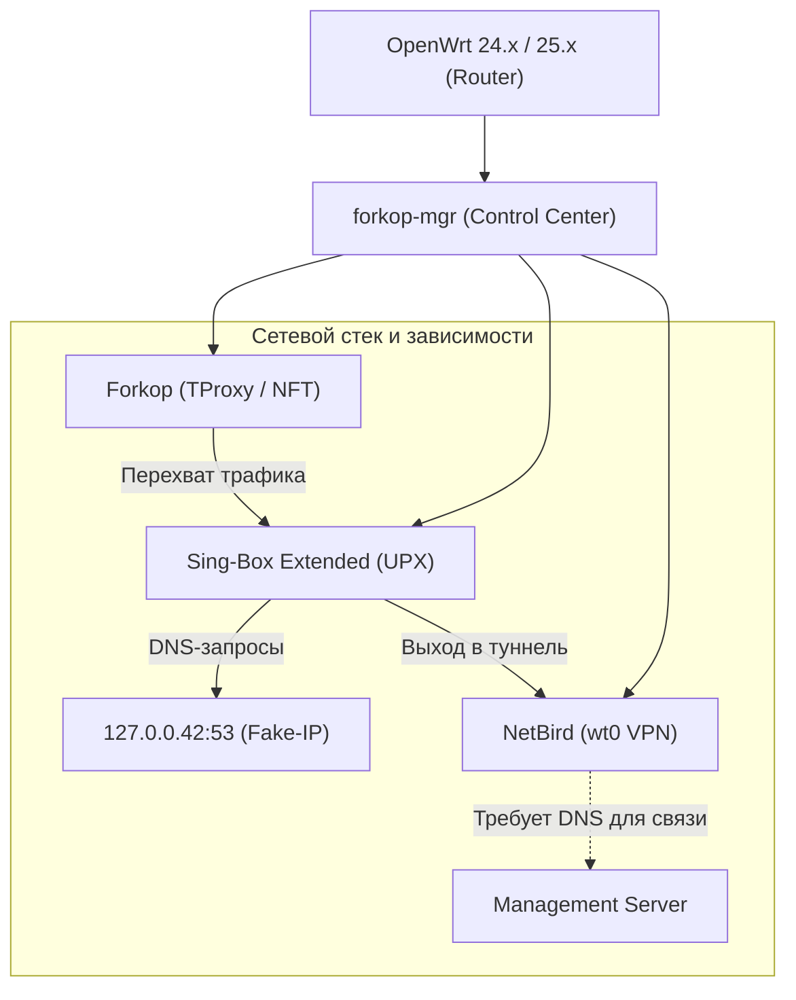
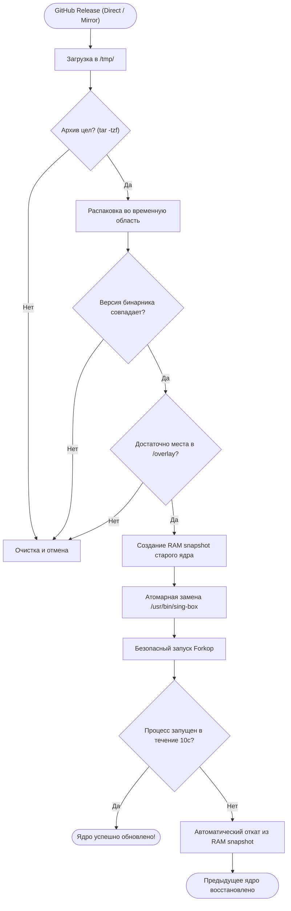
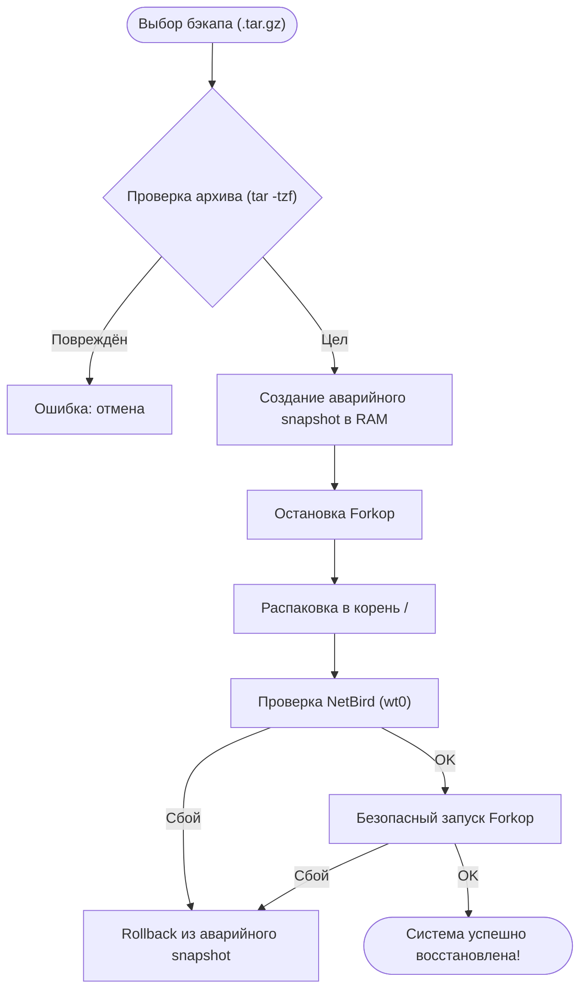
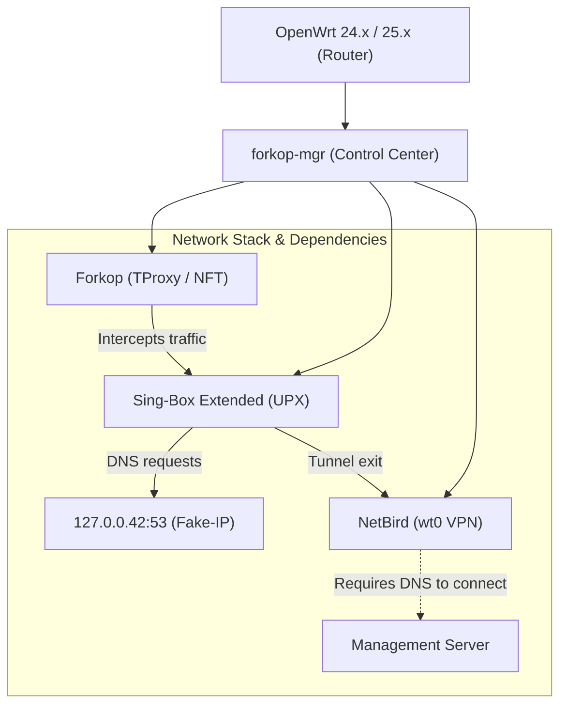
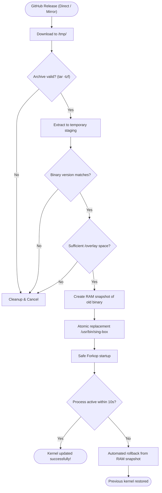
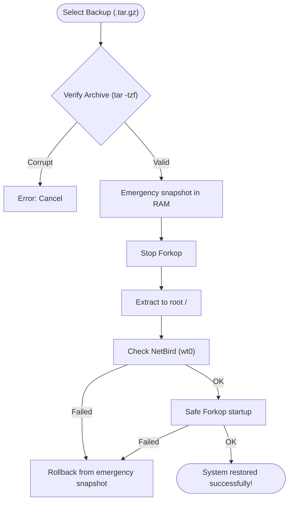

# 🎛️ Forkop Control Center (`forkop-mgr`)

[](https://openwrt.org/)
[](https://www.gnu.org/software/bash/)
[](https://openwrt.org/docs/techref/targets)
[](https://opensource.org/licenses/MIT)

**Универсальный инструмент автоматизации, безопасного обслуживания и восстановления связки Forkop + Sing-Box Extended + NetBird на роутерах с OpenWrt 24.x / 25.x.**

Специально оптимизирован для устройств с компактным разделом `/overlay`, включая **Xiaomi Redmi Router AX6000** со стандартной разметкой (stock layout).

[🇷🇺 RU](#-ru) · [🌐 EN](#-en)

---

# 🇷🇺 RU

## 📌 О проекте

`forkop-mgr` — интерактивный консольный центр управления для безопасного обслуживания сетевого стека роутера:

- **Forkop** — маршрутизация, списки обхода блокировок и TProxy;
- **Sing-Box Extended** — производительное сетевое ядро с современными протоколами;
- **NetBird** — P2P mesh-туннель (`wt0`);
- **OpenWrt 24.x / 25.x** с пакетным менеджером `apk`.

Главная цель утилиты — свести к минимуму риск повреждения системы при обновлениях, автоматизировать решение сетевых циклов (DNS-петель) и экономить ресурс flash-памяти за счёт работы в оперативной памяти (`/tmp`).

---

## 🌟 Ключевые возможности

### ⚡ Управление ядром Sing-Box Extended
- Интерактивный выбор одной из **3 последних версий** из GitHub API.
- Загрузка официальных **UPX-сжатых** сборок для ARM64 (`compressed.tar.gz`).
- Экономия flash-памяти: около **20 МБ вместо ~100 МБ**.
- **Предварительная валидация:** проверка целостности архива (`tar -tzf`), запуск тестового бинарника и сверка версии до внесения изменений в систему.
- **Расчёт дискового пространства:** проверка доступного места в `/overlay` с учётом размера заменяемого ядра.
- **Автоматический откат (Rollback):** сохранение снимка старого бинарника в RAM. Если новое ядро не запускается в течение 10 секунд, менеджер мгновенно восстанавливает предыдущую рабочую версию.

### 🔄 Безопасное обновление Forkop
- Прямое скачивание пакетов `forkop_<version>.apk` и `luci-app-forkop_<version>.apk` напрямую из официальных релизов.
- Корректная установка через `apk add --allow-untrusted` без костылей и без ручного вмешательства в системные базы `/etc/apk/world` и `/lib/apk/db/installed`.
- Сохранение и автоматическое восстановление пользовательской конфигурации `/etc/config/forkop`.

### 🛡️ Защита NetBird (`wt0`) и предотвращение DNS-петель
Скрипт предотвращает взаимную блокировку сетевых компонентов:
1. Forkop временно останавливается.
2. Перезапускается NetBird.
3. Скрипт ожидает появления интерфейса `wt0` и назначения IPv4-адреса.
4. Только после подтверждения готовности туннеля запускается Forkop.

### 🌐 Обход цензуры и защита от блокировок GitHub
- **Единая сессия:** при работе с GitHub Forkop останавливается ровно один раз перед серией загрузок и запускается в самом конце.
- **Резервные зеркала (Mirror Fallback):** если прямое скачивание блокируется ТСПУ/провайдером, скрипт автоматически переключается на прокси-зеркала (`ghproxy.net`, `gh-proxy.com`).

### 📦 Резервное копирование и восстановление
- Сохранение всех ключевых файлов и каталогов:
  `/etc/config/forkop`, `/etc/forkop`, `/etc/netbird`, `/etc/config/netbird`, `/etc/config/dhcp`, `/etc/crontabs/root`, `/usr/bin/forkop-mgr`.
- Постоянное хранение в `/etc/forkop_backups/` и удобная копия в `/tmp/` для скачивания на ПК.
- Создание аварийного snapshot перед восстановлением и автоматический откат при неудаче.

### 🩺 Комплексный перезапуск и диагностика
- **Быстрый безопасный перезапуск:** перезапуск NetBird → ожидание `wt0` → старт Forkop → рестарт `dnsmasq` → сброс NAT-таблиц `conntrack -F` → прогрев Fake-IP и нод → обновление подписок.
- **Global Check:** прямой вызов встроенного теста `/usr/bin/forkop global_check` прямо из консоли с выводом задержек нод и правил nftables.

---

## 🏗️ Архитектура сетевого стека



### Разрыв циклической DNS-зависимости

При перезапуске может возникнуть тупиковая ситуация: NetBird не может отрезолвить адрес своего координатора без DNS, а DNS перехвачен ядром, которое ждёт туннель NetBird. `forkop-mgr` разрешает этот цикл строгой последовательностью:


---

## 🔄 Схема безопасного обновления Sing-Box



---

## 🖥️ Консольный интерфейс

Главный экран менеджера автоматически определяет модель устройства, версию прошивки и сетевые статусы:

```text
========================================================
             FORKOP CONTROL CENTER                     
========================================================
  Устройство : Xiaomi Redmi Router AX6000 (stock layout) (OpenWrt 25.12.5)
  Ядро       : 1.14.1-extended-2.7.2
  Forkop     : 1.0.5
  Туннель    : NetBird UP (wt0: 100.95.59.11)
========================================================
  1) Управление ядром Sing-Box (Extended + UPX)
  2) Обновление Forkop (прямая установка APK)
  3) Резервное копирование и восстановление
  4) Быстрый безопасный перезапуск
  5) Комплексная диагностика (Global Check)
  L) Сменить язык / Switch to English
  0) Выход
========================================================
Выберите раздел [0-5, L]:
```

---

## 🚀 Установка и быстрый старт

### Быстрая установка (в одну команду)

Так как при активном Forkop локальный исходящий трафик роутера к GitHub может перехватываться правилами фаервола, служба временно останавливается на несколько секунд и автоматически стартует после завершения установки:

```sh
/etc/init.d/forkop stop 2>/dev/null || true
sh -c "$(wget -4 -qO- https://raw.githubusercontent.com/Bdata0/forkop-mgr/main/install.sh || curl -4 -fsSL https://raw.githubusercontent.com/Bdata0/forkop-mgr/main/install.sh)"
/etc/init.d/forkop start 2>/dev/null || true
```

### Ручная установка без инсталлятора

```sh
/etc/init.d/forkop stop 2>/dev/null || true
wget -4 -O /usr/bin/forkop-mgr https://raw.githubusercontent.com/Bdata0/forkop-mgr/main/forkop-mgr
chmod +x /usr/bin/forkop-mgr
/etc/init.d/forkop start 2>/dev/null || true
```

### Запуск:

```sh
forkop-mgr
```

---

## 📦 Резервное копирование и восстановление

### Создание бэкапа
Архив формируется автоматически и сохраняется в постоянный каталог:
```text
/etc/forkop_backups/forkop_backup_YYYYMMDD_HHMMSS.tar.gz
```
Для быстрого скачивания создаётся копия в `/tmp/`.

### Скачивание на компьютер (PowerShell / Linux / macOS):
```sh
scp -O root@192.168.11.1:/tmp/forkop_backup_*.tar.gz .
```

### Процесс восстановления с Rollback:



---

## ⚙️ Системные требования

| Компонент | Требование |
|---|---|
| **ОС** | OpenWrt 24.x / 25.x |
| **Пакетный менеджер** | `apk` |
| **Архитектура** | ARM64 / AArch64 |
| **Целевой SoC** | MediaTek MT7986A и аналогичные |
| **Оболочка (Shell)** | POSIX `/bin/sh` (BusyBox ash) |
| **Необходимые утилиты** | `curl` или `wget`, `tar`, `ca-certificates` |

---

## 🔐 Безопасность данных NetBird

Архивы бэкапов содержат **приватные ключи и конфигурации NetBird** (`/etc/netbird/config.json`).
* **Не загружайте бэкапы** в публичные репозитории или файлообменники.
* При замене роутера на такой же используйте полный бэкап для сохранения IP в mesh-сети.
* При настройке нового независимого узла **не переносите старые ключи** — используйте новый `Setup Key`.

---

## 🩺 Ручная диагностика через терминал

```sh
# Проверка статуса туннеля NetBird
netbird status
ip addr show wt0

# Проверка версии и валидности ядра Sing-Box
sing-box version
sing-box check -c /etc/sing-box/config.json

# Проверка пакета Forkop
apk info -v | grep '^forkop-'

# Тест прямого доступа к GitHub
curl -4 -Iv https://raw.githubusercontent.com/

# Запуск встроенной комплексной проверки
forkop global_check
```

---

## 🗂️ Структура проекта

```text
forkop-mgr/
├── forkop-mgr        # Главный исполняемый скрипт центра управления
├── install.sh        # Скрипт автоматической установки с валидацией
└── README.md         # Документация проекта (RU / EN)
```

- Конфигурация языка: `/etc/forkop/mgr.lang`
- Папка бэкапов: `/etc/forkop_backups/`
- Временная рабочая область: `/tmp/forkop-mgr/` (очищается автоматически)

---

# 🌐 EN

## 📌 About

`forkop-mgr` is an interactive CLI control center for safely maintaining the network stack on OpenWrt routers running:

- **Forkop** — routing policies, split tunneling, and TProxy rules;
- **Sing-Box Extended** — high-performance modern proxy core;
- **NetBird** — P2P mesh VPN tunnel (`wt0`);
- **OpenWrt 24.x / 25.x** with the `apk` package manager.

The primary objective is to eliminate flash wear and prevent bricked network configurations by executing all staging operations in RAM (`/tmp`).

---

## 🌟 Key Features

### ⚡ Sing-Box Extended Management
- Interactive selection of the **3 latest releases** from GitHub API.
- Direct download of official **UPX-compressed** ARM64 builds (`compressed.tar.gz`).
- Significant flash savings: **~20 MB instead of ~100 MB**.
- **Multi-stage validation:** archive integrity test (`tar -tzf`), executable startup test, and version verification prior to replacing files.
- **Storage safety check:** calculates required `/overlay` capacity accounting for the replacement of the existing core.
- **Automated rollback:** preserves a RAM snapshot of the previous binary. If the new core fails to start within 10 seconds, the previous working binary is restored automatically.

### 🔄 Safe Forkop Package Updates
- Direct download of `forkop_<version>.apk` and `luci-app-forkop_<version>.apk` from official release assets.
- Clean installation via `apk add --allow-untrusted` without touching `/etc/apk/world` or internal APK package databases manually.
- Automatically preserves and restores `/etc/config/forkop`.

### 🛡️ NetBird (`wt0`) Lifecycle & DNS Loop Prevention
Avoids mutual deadlocks between NetBird and DNS resolution:
1. Forkop is stopped temporarily.
2. NetBird service is restarted.
3. Waits for `wt0` to obtain an active IPv4 address.
4. Forkop starts only after the tunnel is verified.

### 🌐 Anti-Censorship & GitHub Mirroring
- **Single-Session Network Mode:** Forkop is stopped at most once during an entire sequence of downloads, eliminating connection flapping.
- **Mirror Fallback:** Automatically switches to proxy mirrors (`ghproxy.net`, `gh-proxy.com`) if GitHub is throttled or blocked by ISPs/TSPU.

### 📦 Backup & Recovery
- Archives essential configurations:
  `/etc/config/forkop`, `/etc/forkop`, `/etc/netbird`, `/etc/config/netbird`, `/etc/config/dhcp`, `/etc/crontabs/root`, `/usr/bin/forkop-mgr`.
- Stored permanently in `/etc/forkop_backups/` and duplicated in `/tmp/` for easy retrieval.
- Automated rollback snapshot created before restoration.

### 🩺 Complete Restart & Diagnostics
- **Quick Safe Restart:** NetBird restart → wait for `wt0` → start Forkop → restart `dnsmasq` → flush `conntrack -F` → warm up Fake-IP/nodes → refresh subscriptions.
- **Global Check:** Launches `/usr/bin/forkop global_check` directly in the terminal, showing node latency and nftables health without opening a browser.

---

## 🏗️ Network Architecture



### Breaking the Circular DNS Dependency

During cold startup, NetBird cannot resolve its management server without DNS, while DNS is captured by the proxy core which depends on NetBird's tunnel. `forkop-mgr` orchestrates the startup sequence to break this cycle:


---

## 🔄 Safe Sing-Box Update Workflow



---

## 🖥️ Terminal UI

```text
========================================================
             FORKOP CONTROL CENTER                     
========================================================
  Device : Xiaomi Redmi Router AX6000 (stock layout) (OpenWrt 25.12.5)
  Kernel : 1.14.1-extended-2.7.2
  Forkop : 1.0.5
  Tunnel : NetBird UP (wt0: 100.95.59.11)
========================================================
  1) Sing-Box Extended Kernel Management (UPX)
  2) Update Forkop (Direct APK installation)
  3) Backup & Restore
  4) Quick safe restart
  5) System diagnostics (Global Check)
  L) Change language / Переключить на русский
  0) Exit
========================================================
Select a section [0-5, L]:
```

---

## 🚀 Installation & Quick Start

### One-Liner Installation (Recommended)

Because active Forkop routing can intercept outbound router traffic to GitHub, Forkop is stopped briefly during installation and restarted automatically upon completion:

```sh
/etc/init.d/forkop stop 2>/dev/null || true
sh -c "$(wget -4 -qO- https://raw.githubusercontent.com/Bdata0/forkop-mgr/main/install.sh || curl -4 -fsSL https://raw.githubusercontent.com/Bdata0/forkop-mgr/main/install.sh)"
/etc/init.d/forkop start 2>/dev/null || true
```

### Manual Installation

```sh
/etc/init.d/forkop stop 2>/dev/null || true
wget -4 -O /usr/bin/forkop-mgr https://raw.githubusercontent.com/Bdata0/forkop-mgr/main/forkop-mgr
chmod +x /usr/bin/forkop-mgr
/etc/init.d/forkop start 2>/dev/null || true
```

### Launch:

```sh
forkop-mgr
```

---

## 📦 Backup & Recovery

### Creating a Backup
Backups are archived into:
```text
/etc/forkop_backups/forkop_backup_YYYYMMDD_HHMMSS.tar.gz
```
A temporary copy is placed in `/tmp/` for convenient SCP transfer.

### Download to PC (PowerShell / Linux / macOS):
```sh
scp -O root@192.168.11.1:/tmp/forkop_backup_*.tar.gz .
```

### Restore with Automated Rollback:



---

## ⚙️ System Requirements

| Component | Requirement |
|---|---|
| **OS** | OpenWrt 24.x / 25.x |
| **Package Manager** | `apk` |
| **Architecture** | ARM64 / AArch64 |
| **Target SoC** | MediaTek MT7986A and compatible |
| **Shell** | POSIX `/bin/sh` (BusyBox ash) |
| **Required Utilities** | `curl` or `wget`, `tar`, `ca-certificates` |

---

## 🔐 Security & NetBird Credentials

Backup archives contain **private keys and authentication tokens** (`/etc/netbird/config.json`).
* **Never commit backup files** to public git repositories or file hosts.
* When replacing a router with identical hardware, restoring the full backup preserves the mesh node IP.
* When provisioning a new independent node, **do not restore existing keys** — use a fresh `Setup Key`.

---

## 🩺 Manual Terminal Diagnostics

```sh
# Check NetBird status & tunnel
netbird status
ip addr show wt0

# Verify sing-box version and configuration
sing-box version
sing-box check -c /etc/sing-box/config.json

# Check installed Forkop package
apk info -v | grep '^forkop-'

# Test direct GitHub connectivity
curl -4 -Iv https://raw.githubusercontent.com/

# Execute built-in diagnostic suite
forkop global_check
```

---

## 🗂️ Project Structure

```text
forkop-mgr/
├── forkop-mgr        # Main interactive management utility
├── install.sh        # Installer script with syntax validation
└── README.md         # Bilingual project documentation (RU / EN)
```

- Language configuration: `/etc/forkop/mgr.lang`
- Backup directory: `/etc/forkop_backups/`
- Temporary workspace: `/tmp/forkop-mgr/` (automatically cleaned)

---

## 🔗 Upstream Projects

- **Forkop:** [https://github.com/ushan0v/forkop](https://github.com/ushan0v/forkop)
- **sing-box Extended:** [https://github.com/shtorm-7/sing-box-extended](https://github.com/shtorm-7/sing-box-extended)
- **NetBird:** [https://github.com/netbirdio/netbird](https://github.com/netbirdio/netbird)

---

## 📜 License

Distributed under the **MIT License**.
